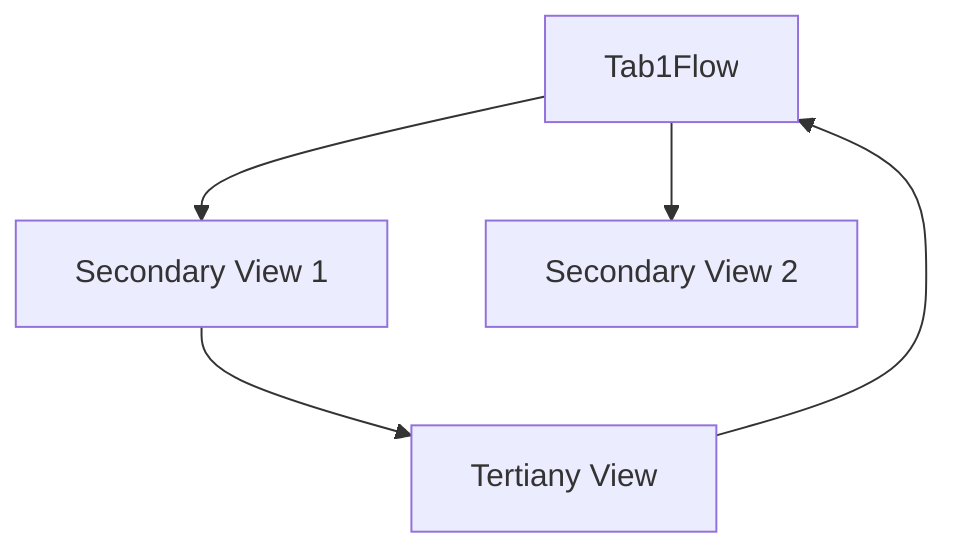
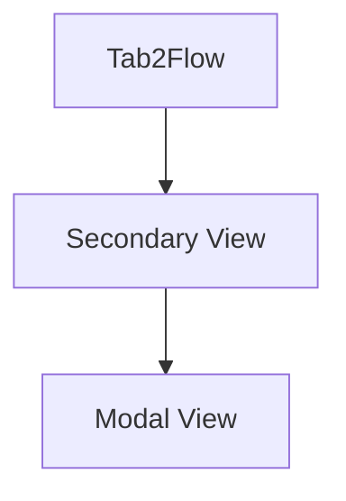

# MVVM-C iOS Sample tampalte
This repository contains a sample MVVM-C template for SwiftUI. 

This repository serves as the foundational code for the accompanying blog post.[The MVVM-C Blueprint for iOS Apps](https://javios.eu/swift/harnessing-nfc-technology-in-your-ios-app/) 

# Navigation flows
- First Tab Flow

- Second Tab Flow

## 🎥 Demo Video

### Check out the app in action!  
  

## Requirements

- **Xcode 15.0 or later**
- **iOS 16.0 or later**
- **Swift 6.0**

